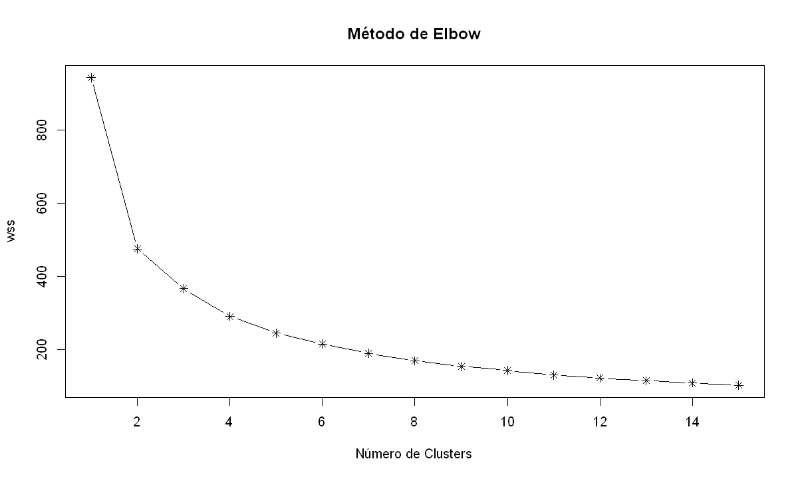

Este é um projeto de clusterização.

O conjunto de dados utilizado está disponível [neste link](https://www.kaggle.com/rafaelgfelippe/food-delivery).

# Entendimento do Negócio

A Big Rango é um restaurante do tipo *Dark Kitchen*, ou seja, é um estabelecimento de serviço de alimentação que oferece apenas comida para viagem. Atuando em 9 cidades, a Big Rango é um restaurante 100% delivery, onde os pedidos são realizados via telefone ou internet, e entregues diretamente aos clientes.

Visando oferecer uma comunicação assertiva e personalizada, a Big Rango contratou um consultor em ciência de dados para realizar a segmentação de seus clientes. O principal objetivo da empresa é identificar os principais padrões de consumo e assim, realizar campanhas de Marketing customizadas para cada grupo de clientes. 

Além disso, a empresa também estuda adicionar novos pratos no cardápio, que atualmente, é composto por pizzas, bebidas, saladas e sobremesas. A segmentação dos clientes também pode auxiliar a empresa nessa tarefa. 

# Dicionário de Dados

Em relação ao conjunto de dados, as seguintes informações foram disponibilizadas:

- Os dados estão em formato estruturado e serão disponibilizados em um arquivo "csv".
- A variável id_transacao possui o mesmo código para cada item dentro de um pedido.
- Todos os pedidos são referentes ao ano de 2019.
- A empresa não trabalha das 2 as 10 horas da manhã.

Além disso, também foi disponibilizado o dicionário de dados:

| Variáveis                        | Descrição                                                    |
| -------------------------------- | ------------------------------------------------------------ |
| id_transacao                     | Identificação do pedido                                      |                          
| horario_pedido                   | Horário do pedido                                            |
| localidade                       | Local da unidade do restaurante                              |
| nome_item                        | Nome do item pedido                                          |
| quantidade_item                  | Quantidade do item no pedido                                 |
| latitude                         | Latitude da localidade do restaurante                        |
| longitude                        | Longitude da localidade do restaurante                       |

# Estratégia da Solução

Como estratégia para a solução dos problemas, definimos as seguintes etapas:

- **1. Entendimento do Negócio:** nesta etapa inicial, realizamos uma breve introdução sobre o tema do projeto, entendemos as necessidades do cliente e definimos nossos objetivos.

- **2. Entendimento dos Dados:** o objetivo é realizar um tratamento inicial para verificar a qualidade dos dados, também realizaremos uma análise mais detalhada a fim de responder perguntas sobre o negócio.

- **3. Engenharia de Atributos:** nessa sessão, iremos visualizar os dados de uma outra perspectiva, além de realizar a seleção das melhores variáveis.

- **4. Pré-Processamento dos Dados:** nesta etapa, o objetivo é preparar os dados para a aplicação do modelo de Machine Learning.

- **5. Modelagem Preditiva:** utilizaremos o K-means, um dos algoritmos mais utilizados para problemas de clusterização.

- **6. Análise de Clusters:** iremos explorar os clusters com objetivo de identificar padrões e recomendar ações para a área de Marketing.

- **7. Conclusões Finais:** por fim, entregaremos o resultado final do projeto.

# TOP 3 Insights 

**P1. Qual o mês que teve o maior e o menor número de pedidos?**
- Maio foi o mês que teve o maior número de pedidos, enquanto fevereiro registrou o menor número.

**P5. Quais são os itens mais pedidos por horário?**
- Entre 0h e 1h os itens predominantes são sobremesa e pizza.
- Durante o horário de almoço, sobremesa e salada são os principais itens.
- Durante o horário de jantar, há um grande aumento nos pedidos de sobremesa, pizza e bebida.

**P7. Quais os itens mais pedidos em cada localidade?**
- Sobremesa é o principal item nos pedidos de todas as localidades.

# Modelagem Preditiva

Para realizar a segmentação da base de clientes da Big Rango, optamos por utilizar o algoritmo *K-Means*, um dos mais utilizados para esse tipo de tarefa. 

Através do método de *ELbow*, 3 foi definido como o número ideal de clusters para segmentar os clientes. 

Utilizando uma amostra dos dados, podemos visualizar como o algoritmo realizou a segmentação para cada um dos clusters. 

# Análise de Clusters

Os dados foram segmentados conforme a imagem abaixo.

## Cluster 1

**Principais Características do Cluster 1:**

- Possui o menor número de pedidos (19%).
- É o principal consumidor de salada.
- Pizza e bebida somam apenas 7% do total dos pedidos.

Pedidos são realizados essencialmente no horário de almoço.

**Recomendações para o Departamento de Marketing:**

- Incluir mais opções de produtos saudáveis no cardápio, como lanches naturais, comidas veganas e chás, principalmente no horário de almoço, onde ocorre o maior número de pedidos desse segmento. Para o período noturno, onde esses clientes são menos presentes, oferecer esses novos produtos pode ser uma estratégia para aumentar as vendas nesse horário.
- Criar promoções envolvendo os itens salada e sobremesa, como por exemplo: "Na compra da salada "X", ganhe uma sobremesa grátis".
